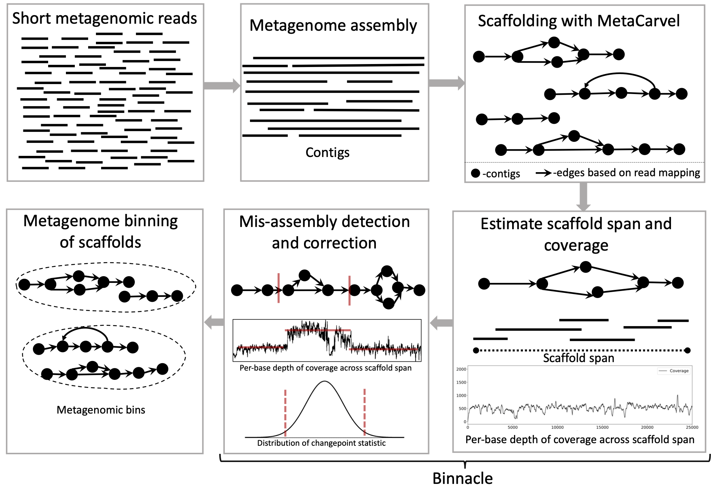

### In this page I maintain a list of some projects that I have actively contributed to. 

* * *

## **Binnacle**
{: style="float: left; padding-right:10px" ;height="90%" width="42%"}
Binnacle accurately computes coverage of graph scaffolds and seamlessly integrates with leading binning methods such as MetaBAT2, MaxBin 2.0, and CONCOCT. Using graph scaffolds, as opposed to contigs (most common approach) for binning improves the contiguity and quality of metagenomic bins and can captures a broader set of the accessory elements of the reconstructed genomes. We use [MetaCarvel](https://github.com/marbl/MetaCarvel){:target="_blank"} a tool developed at Poplab to generate variant aware scaffolds. A poster version of binnacle appeared in ISMB 2020 and please find a short talk [here](https://www.youtube.com/watch?v=MEq3yDuYoOQ&ab_channel=ISCB){:target="_blank"}. The instructions to perform binning with binnacle can be found [here](https://github.com/marbl/binnacle){:target="_blank"}.

* * *

## **PIRATE**
{: style="float: left; padding-right:10px" ;height="90%" width="42%"}
Bacteriophages are viruses that infect and destroy bacteria. As bacteria rapidly evolve to counter the effect of antibiotic drugs, bacteriophages are being explored as complements and alternatives to antibiotics. Identification and characterization of novel phage from sequencing data is critical to achieve this goal, but presents many computational challenges. We developed [MetaCarvel](https://github.com/marbl/MetaCarvel){:target="_blank"}, a scaffolding tool that detects assembly graph motifs representative of biologically-relevant variants. Some bubble and repeat motifs detected by MetaCarvel represent phage integration events, providing the opportunity for detecting novel phage within microbial communities. Our assembly graph based methods were able to detect crAssphage (the first computationally identified phage) within variants in 208 human gut microbiome samples. To identify novel phage in metagenomes, we extracted repeat and bubble contigs that did not share sufficient similarity with known organisms. We clustered contigs with similar genomic content and blasted predicted genes from each cluster against a custom UniProt phage database. Multiple clusters contained sequences rich in integrase genes, tail proteins and tape measure proteins, suggesting these sequences represent genomicfragments from previously uncharacterized phage. PIRATE is still under active development and PIRATE appeared as a [short talk](https://www.youtube.com/watch?v=YytwmfCYLFY&ab_channel=ISCB){:target="_blank"} at ISMB 2020. 

* * *

## **SCRAPT**
{: style="float: left; padding-right:10px" ;height="105%" width="49%"} 
**Motivation**: 16S rRNA gene sequence clustering is an important tool in characterizing the diversity of microbial communities. As 16S rRNA gene data sets are growing in size, existing sequence clustering algorithms increasingly become an analytical bottleneck. Existing methods spend a lot of time with clustering singletons and produce fragmented clusters leaving a gap for further improvements.<br />
**Results**: We propose an iterative sampling-based 16S rRNA gene sequence clustering approach that targets the largest clusters in the data set, allowing users to stop the clustering process when sufficient clusters are available for the specific analysis being targeted. We describe a probabilistic analysis of the iterative clustering process that supports the intuition that the clustering process identifies the larger clusters in the data set first. Using real data sets of 16S rRNA gene sequences, we show that our iterative algorithm, coupled with an adaptive sampling process and a mode-shifting strategy for identifying cluster representatives, substantially speeds up the clustering process while being effective at capturing the large clusters in the dataset. The experiments also show SCRAPT is able to produce Operational Taxonomic Unit (OTUs) which are less fragmented than popular tools DNACLUST, CDHIT, UCLUST, and DADA2.<br />
**Software Availability**:  The algorithm is implemented in the open-source package [```SCRAPT```](https://github.com/hsmurali/SCRAPT){:target="_blank"}. 
